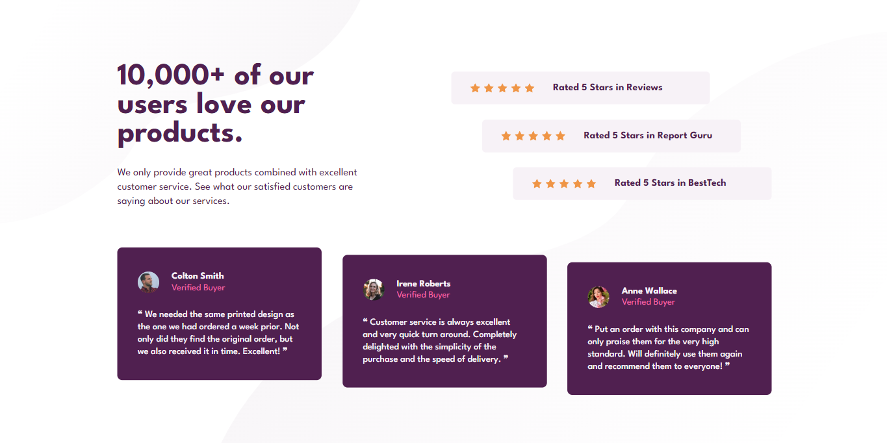

# Frontend Mentor - Profile card component solution

This is a solution to the [Profile card component challenge on Frontend Mentor](https://www.frontendmentor.io/challenges/profile-card-component-cfArpWshJ).

## Overview

### The challenge

- Build a profile card component as similar to the design shown as possible.

### Screenshot

### Links

- Solution URL: [https://www.frontendmentor.io/solutions/social-proof-section-using-css-flexbox-JwOeCpPio7](https://www.frontendmentor.io/solutions/social-proof-section-using-css-flexbox-JwOeCpPio7)
- Live Site URL: [https://playful-croquembouche-b77c17.netlify.app/](https://playful-croquembouche-b77c17.netlify.app/)

### Built with

- Semantic HTML5 markup
- Acessible HTML5 markup
- CSS custom properties
- CSS grid layout

### What I learned

This challenge was a good way for me to start my learning and applications of CSS Flexbox.

### Continued development

For my next project, I will study and apply the following concept:

- Resposive Layout

## Author

- Frontend Mentor - [@thullyoufrn](https://www.frontendmentor.io/profile/thullyoufrn)
- Linkedin - [Thullyo Damasceno](https://www.linkedin.com/in/thullyo-damasceno-375083231)
